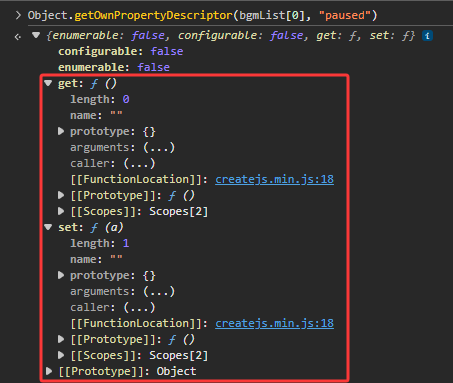

# 基本语法

对于 JavaScript 的基本语法，此处介绍一些不太常见但重要的语法特性，用于拓展对 JavaScript 语言的理解。

## 全等运算符

全等运算符 `===`（Strict Equality Operator），用于比较两个值是否严格相等。与普通的相等运算符 `==` 不同，全等运算符不会进行类型转换，如果两个值的类型不同，则直接返回 `false`。

```js
console.log(1 === 1); // true，类型和值都相等
console.log(1 === "1"); // false，类型不同

// null 是一个特殊的值，只有一个值 null
console.log(null === null); // true

// undefined 是一个特殊的值，只有一个值 undefined
console.log(undefined === undefined); // true，

// NaN 是一个特殊的值，表示“不是一个数字”，它不等于任何值，包括它自己
console.log(NaN === NaN); // false
console.log(Number.isNaN(NaN)); // true，使用 Number.isNaN 函数来判断一个值是否是 NaN
```

::: tip

比较有意思的是 NaN（Not A Number）的类型是 number

```js
console.log(typeof NaN); // "number"
```

:::

对应全等运算符的还有不全等运算符 `!==`（Strict Inequality Operator），用于比较两个值是否不全等。与普通的不相等运算符 `!=` 不同，不全等运算符也不会进行类型转换，如果两个值的类型不同，则直接返回 `true`。

```js
console.log(1 !== 1); // false，类型和值都相等
console.log(1 !== "1"); // true，类型不同
console.log(null !== null); // false，类型和值都相等
console.log(undefined !== undefined); // false，类型和值都相等
console.log(NaN !== NaN); // true，NaN 不等于任何值
```

一般来说，建议在 JavaScript 中全部使用全等运算符 `===` 和不全等运算符 `!==` 来进行比较，以避免类型转换带来的潜在问题和不确定性。两者可以更准确地判断两个值是否相等，尤其是在比较不同类型的值时。

## 模板字符串

模板字符串（Template Literals）是一种增强的字符串字面量，使用反引号（`` ` ``）包裹，可以包含嵌入表达式和多行文本。模板字符串的语法如下：

```js {2}
const name = "Alice";
const greeting = `Hello, ${name}!`; // 使用 ${} 来嵌入表达式
console.log(greeting); // "Hello, Alice!"
```

模板字符串的核心优势在于：支持多行文本直接书写（无需拼接换行符），并通过 ${} 语法自然嵌入变量与表达式，彻底告别 + 拼接的繁琐与易错问题，显著提升代码可读性。

```js
const multiLine = `This is a multi-line
string.`;
// This is a multi-line
// string.
console.log(multiLine);
```

## 解构赋值、展开运算符和剩余参数语法

**解构赋值（Destructuring Assignment）** 是一种方便的语法，可以从数组或对象中提取值并赋给变量。而 **展开运算符（Spread Operator）** 则可以将数组或对象展开成单独的元素或属性。

**剩余参数（Rest Parameters）语法** 允许我们将函数的参数收集到一个数组中，或者在解构赋值中收集剩余的元素或属性，在此一并介绍。

### 数组、对象解构赋值

基本使用，可以在变量声明时直接解构赋值，也可以在函数参数中使用解构赋值。

```js {2,7,12,17}
// 数组解构
const [a, b] = [1, 2];
console.log(a); // 1
console.log(b); // 2

// 对象解构
const { name, age } = { name: "Bob", age: 30 };
console.log(name); // "Bob"
console.log(age); // 30

// 解构可以用于嵌套结构
const person = { name: "Alice", age: 25, address: { city: "New York", zip: "10001" } };
const {
  name: personName,
  address: { city },
} = person;
console.log(personName); // "Alice"
console.log(city); // "New York"

// 函数数组参数解构
function printCoordinates([x, y]) {
  console.log(`X: ${x}, Y: ${y}`);
}

// 函数对象参数解构
function printUser({ name, age }) {
  console.log(`Name: ${name}, Age: ${age}`);
}
```

在解构赋值中，我们还可以使用默认值来处理未定义的情况：

```js {3,8}
// 数组解构默认值
const [x = 0, y = 0] = [5];
console.log(x); // 5
console.log(y); // 0

// 对象解构默认值
const { name = "Unknown", age = 0 } = { name: "Charlie" };
console.log(name); // "Charlie"
console.log(age); // 0

// 函数对象参数解构默认值
function greet({ name = "Guest" } = {}) {
  console.log(`Hello, ${name}!`);
}
greet(); // "Hello, Guest!"

// 函数数组参数解构默认值
function sum([a = 0, b = 0] = []) {
  return a + b;
}
console.log(sum()); // 0
```

::: info

在 C、C++、Java 等语言的教学中，常常会有交换两个变量值的例子，使用解构赋值可以非常简洁地实现这一功能，且不需要引入临时变量：

```js {3}
let x = 5;
let y = 10;
[x, y] = [y, x]; // 交换 x 和 y 的值
```

在 Python 中也有类似的语法（仅作介绍，无需了解）：

```python {3}
x = 5
y = 10
x, y = y, x  # 交换 x 和 y 的值
```

想要不使用临时变量交换两个变量的值，还可以使用加法和减法的方式，但这需要一些特殊的数学技巧，并且在某些情况下可能会导致溢出问题，因此不推荐使用这种方法。

```js
let x = 5;
let y = 10;
x = x + y; // x 现在是 15
y = x - y; // y 现在是 5
x = x - y; // x 现在是 10
```

:::

### 展开运算符

展开运算符使用三个点（`...`）表示，可以将数组或对象等 **可迭代对象** 展开成单独的元素或属性，常用于数组和对象的合并、函数参数传递等场景：

```js {3,8,14}
// 展开数组
const arr1 = [1, 2];
const arr2 = [...arr1, 3, 4]; // 将 arr1 展开成单独的元素
console.log(arr2); // [1, 2, 3, 4]

// 展开对象
const obj1 = { x: 1, y: 2 };
const obj2 = { ...obj1, z: 3 }; // 将 obj1 展开成单独的属性
console.log(obj2); // { x: 1, y: 2, z: 3 }

// 展开为函数参数
const sum = (a, b, c) => a + b + c;
const numbers = [1, 2, 3];
console.log(sum(...numbers)); // 将 numbers 展开成单独的参数，输出 6
```

::: warning

需要注意展开运算符本质上是一个浅拷贝（shallow copy），当展开一个对象或数组时，如果其中包含引用类型的值（如对象或数组），则展开后的新对象或数组中的这些值仍然指向原来的引用类型值。这意味着如果修改了展开后的对象或数组中的引用类型值，原来的对象或数组中的对应值也会受到影响。

```js {3,8}
const original = { a: 1, b: { c: 2 } };
const copy = { ...original };
copy.b.c = 3;
console.log(original.b.c); // 输出 3，说明 original 中的 b.c 也被修改了
```

:::

### 剩余参数

剩余参数语法允许我们将函数的参数收集到一个数组中，或者在解构赋值中收集剩余的元素或属性。剩余参数使用三个点（`...`）表示，常用于函数参数、数组解构和对象解构。

需要注意的是，剩余参数必须是函数参数列表中的最后一个参数，或者在解构赋值中必须放在最后，否则会导致语法错误。

```js {2,10,15}
// 函数参数中的剩余参数
function sum(num1, num2, ...numbers) {
  // 单独提取前两个参数 num1 和 num2 进行处理
  console.log(`num1: ${num1}, num2: ${num2}`);
  // 重新使用展开运算符将剩余参数展开成单独的元素进行求和
  return [num1, num2, ...numbers].reduce((total, num) => total + num, 0);
}

// 数组解构中的剩余元素
const [first, ...rest] = [1, 2, 3, 4];
console.log(first); // 1
console.log(rest); // [2, 3, 4]

// 对象解构中的剩余属性
const { a, ...others } = { a: 1, b: 2, c: 3 };
console.log(a); // 1
console.log(others); // { b: 2, c: 3 }
```

## for...in 和 for...of 循环

JavaScript 除了基本的 `for` 语句，还提供了两种特殊的循环语法：`for...in` 和 `for...of`，用于遍历对象和可迭代对象。

`for...in` 循环用于遍历对象的 [**可枚举属性**](../其他知识点/对象属性.md#可枚举属性)，返回属性名（键）。需要注意的是，`for...in` 会遍历对象及其原型链上的所有可枚举属性，因此在使用时需要进行适当的过滤。

```js {7,12}
const parent = { a: 1, b: 2, c: 3 };
const child = Object.create(parent);
Object.assign(child, { d: 4, e: 5 }); // child 对象有自己的属性 d 和 e
for (const key in child) {
  // 过滤掉原型链上的属性
  if (child.hasOwnProperty(key)) {
    console.log(key); // 输出 d, e
  }
}
for (const key in child) {
  // 不过滤原型链上的属性
  console.log(key); // 输出 d, e, a, b, c
}
```

`for...of` 循环用于遍历 [**可迭代对象**](../其他知识点/可迭代对象.md)，返回元素值。

常见的可迭代对象包括 [数组][LINK_ARRAY]、[字符串][LINK_STRING]、[Map][LINK_MAP]、[Set][LINK_SET] 等。

最常见的用法是遍历数组，也可以遍历 [`Object.entries`](https://developer.mozilla.org/zh-CN/docs/Web/JavaScript/Reference/Global_Objects/Object/entries)、[`Object.values`](https://developer.mozilla.org/zh-CN/docs/Web/JavaScript/Reference/Global_Objects/Object/values) 等返回的可迭代对象：

```js {8,11}
const arr = [1, 2, 3];
for (const value of arr) {
  console.log(value); // 输出 1, 2, 3
}

const obj = { a: 1, b: 2, c: 3 };
// 在此处用了解构赋值来直接获取 key 和 value
for (const [key, value] of Object.entries(obj)) {
  console.log(`${key}: ${value}`); // 输出 a: 1, b: 2, c: 3
}
for (const value of Object.values(obj)) {
  console.log(value); // 输出 1, 2, 3
}
```

## 可选链运算符

**可选链运算符（Optional Chaining Operator）** 是一种安全访问对象属性的语法，使用 `?.` 表示。当我们尝试访问一个对象的属性时，如果该对象为 `null` 或 `undefined`，可选链运算符会短路返回 `undefined`，而不会抛出错误。这对于处理深层嵌套的对象结构非常有用，可以避免大量的空值检查。

```js {9-10}
const user = {
  name: "Alice",
  address: {
    city: "New York",
    zip: "10001",
  },
};
// 访问嵌套属性时使用可选链运算符
console.log(user.address?.city); // "New York"
console.log(user.contact?.email); // undefined，contact 不存在但不会抛错
```

当可选链运算符用于数组或函数调用时，如果目标对象为 `null` 或 `undefined`，同样会短路返回 `undefined`：

```js {10-11}
const arr = [1, 2, 3];
console.log(arr?.[0]); // 1

const obj = {
  greet(name) {
    return `Hello, ${name}!`;
  },
};

console.log(obj.greet?.("Bob")); // "Hello, Bob!"
console.log(obj.shout?.("Bob")); // undefined，shout 不存在但不会抛错
```

## 空值合并运算符

**空值合并运算符（Nullish Coalescing Operator）** 是一种用于处理 `null` 和 `undefined` 的语法，使用 `??` 表示。当我们使用空值合并运算符时，如果左侧的值为 `null` 或 `undefined`，则返回右侧的值；否则返回左侧的值。这对于提供默认值非常有用，可以避免将其他假值（如 `0`、`''`、`false`）误认为是无效值。

```js {3}
const name = null;
const defaultName = "Guest";
console.log(name ?? defaultName); // "Guest"，因为 name 是 null
```

`??` 和 `||` 的区别在于，`||` 会将所有假值（如 `0`、`''`、`false`）都视为无效值，而 `??` 只会将 `null` 和 `undefined` 视为无效值。这使得 `??` 更适合处理默认值的场景，避免了误判其他假值的情况。

```js
console.log(0 || "Default"); // "Default"，因为 0 是 falsy 值
console.log(0 ?? "Default"); // 0，因为 0 不是 null 或 undefined

console.log("" || "Default"); // "Default"，因为 '' 是 falsy 值
console.log("" ?? "Default"); // ''，因为 '' 不是 null 或 undefined

console.log(false || "Default"); // "Default"，因为 false 是 falsy 值
console.log(false ?? "Default"); // false，因为 false 不是 null 或 undefined
```

## 箭头函数

**箭头函数（Arrow Functions）** 是一种简洁的函数表达式，使用 `=>` 语法定义。箭头函数与普通函数在语法和行为上有一些重要的区别：

- 语法更简洁，尤其适合定义匿名函数和内联函数
- 不绑定自己的 `this`，`arguments`，`super` 和 `new.target`，它们的值由外部上下文决定
- 不能用作构造函数，不能使用 `new` 关键字调用
- 没有 `prototype` 属性

其中，箭头函数不绑定自己的 `this` 是最重要的特性之一，这使得它在处理回调函数和事件处理器时非常方便，可以避免传统函数中常见的 `this` 绑定问题。

在课件模板每一帧的开头，通常都有一个

```js
let that = this;
```

就是因为在传统函数中，`this` 的值取决于函数的调用方式，可能会导致 `this` 不指向预期的对象。而使用箭头函数后，`this` 的值由外部上下文决定，不会因为调用方式不同而改变，从而避免了这种问题。

```js
function frameCode() {
  const that = this;
  const star = that.star;

  star.on("click", function () {
    // 在传统函数中，this 的值取决于调用方式，可能不指向预期的对象
    console.log(this); // 可能不是 star 对象
    console.log(that); // 正确指向外部上下文的 this
  });

  star.on("click", () => {
    // 在箭头函数中，this 的值由外部上下文决定，不会改变
    console.log(this); // 正确指向外部上下文的 this
  });
}
```

箭头函数的语法非常灵活，可以根据需要省略参数括号、函数体花括号和 return 关键字：

```js
// 无参数时需要空括号
const greet = () => "Hello!";
// 单参数时可以省略括号
// prettier-ignore
const square = x => x * x;
// 多参数时需要括号
const add = (a, b) => a + b;
// 函数体只有一行时可以省略花括号和 return
// prettier-ignore
const double = x => x * 2;
```

## 函数的 call、apply 和 bind 方法

函数的 `call`、`apply` 和 `bind` 方法是 JavaScript 中用于改变函数执行上下文（即 `this` 的值）的重要工具。

- `call` 方法接受一个对象作为第一个参数，后续参数依次传递给函数，并立即调用函数。
- `apply` 方法与 `call` 类似，但它接受一个数组或类数组对象作为第二个参数，数组中的元素将作为函数的参数传递，并立即调用函数。
- `bind` 方法接受一个对象作为第一个参数，后续参数依次传递给函数，但它不会立即调用函数，而是返回一个 **新的函数**，这个新函数的 `this` 值被绑定到传入的对象上，并且可以在需要时调用。

```js
function greet(greeting) {
  console.log(`${greeting}, ${this.name}!`);
}

const person = { name: "Alice" };

greet.call(person, "Hello"); // 立即调用，输出 "Hello, Alice!"

greet.apply(person, ["Hi"]); // 立即调用，输出 "Hi, Alice!"

const boundGreet = greet.bind(person, "Hey"); // 返回一个新的函数，但不立即调用

boundGreet(); // 调用绑定后的函数，输出 "Hey, Alice!"

greet(); // 没有绑定 this，输出 "undefined, !"
```

> 在严格模式下，全局 `this` 是 `window` 对象，`window` 的 `name` 为 `''`，所以 `greet()` 最终的输出为 `"undefined, !"`。

## 访问器属性

**访问器属性（Accessor Properties）** 是 JavaScript 对象的一种特殊属性类型，它们通过 `get` 和 `set` 关键字定义，允许我们将一个属性包装成一个受控的行为。当访问这个属性时，会调用对应的 getter 或 setter 函数，从而实现对属性值的控制和验证。

```js
const person = {
  _age: 0, // 私有属性，通常使用下划线命名

  get age() {
    return this._age;
  },

  set age(value) {
    if (value < 0) {
      throw new Error("年龄不能小于 0");
    }
    this._age = value;
  },
};
```

CreateJS 中，[`AbstractSoundInstance`](https://createjs.com/docs/soundjs/classes/AbstractSoundInstance.html) 类的 [paused](https://createjs.com/docs/soundjs/classes/AbstractSoundInstance.html#property_paused) 属性就是一个访问器属性，当我们给 paused 赋值时，实际上是调用了它的 setter 方法来控制声音的暂停和恢复，而当我们访问 paused 时，则是调用了它的 getter 方法来获取当前的暂停状态。



[LINK_ARRAY]: https://developer.mozilla.org/zh-CN/docs/Learn_web_development/Core/Scripting/Arrays
[LINK_STRING]: https://developer.mozilla.org/zh-CN/docs/Web/JavaScript/Guide/Data_structures#string_%E7%B1%BB%E5%9E%8B
[LINK_MAP]: https://developer.mozilla.org/zh-CN/docs/Web/JavaScript/Reference/Global_Objects/Map
[LINK_SET]: https://developer.mozilla.org/zh-CN/docs/Web/JavaScript/Reference/Global_Objects/Set
